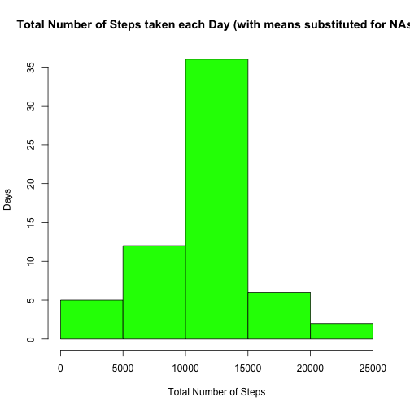

#"ReproducibleResearch Assignment1  
=================================  

## Load & Pre-Proces Data

```r
act.data <- read.csv("activity.csv") ##read activity.csv file
act.data.frame <- data.frame(na.omit(act.data)) ##create a data frame with this info, omitting NAs
library(lattice) ##will use this library later in code
library(knitr)
```
## Mean Steps per Day

```r
sum.steps <- tapply(act.data.frame$steps, act.data.frame$date, sum) ##calculate sum of steps on a given day
hist(sum.steps, xlab = "Total Number of Steps", ylab = "Days", main = "Total Number of Steps taken each Day", col = "blue") ##make a histogram with this data
```

 

```r
mean.steps <- mean(sum.steps, na.rm = TRUE) ##calculate mean no. of steps taken each day
print(mean.steps)
```

```
## [1] 10766
```

```r
median.steps <- median(sum.steps, na.rm = TRUE) ##calculate median no. of steps taken each day
print(median.steps)
```

```
## [1] 10765
```
Mean number of steps taken each day is 10766.  
Median number of steps taken each day is 10765.  

##Average Daily Activity Pattern

```r
steps.interval <- tapply(act.data.frame$steps, act.data.frame$interval, mean) ##calculate mean number of steps per 5 min interval across all days
plot(steps.interval, xlab = "5 minute interval", xaxt = 'n', ylab = "Average Number of Steps Taken", main = "Average Number of Steps Taken", type = "l") ##plot data in graph
axis(1, at = seq(1, 289, by = 36), labels = c("00:00", "03:00", "06:00",  "09:00", "12:00", "15:00", "18:00", "21:00", "24:00"), tick = TRUE) ##add axis labels
```

 

```r
##find max no of steps taken in average 5 min interval in day (averaged across all data)
for(i in 1:289){if(!is.na(steps.interval[i]) && steps.interval[i] == max(steps.interval)){index <- i}} ##find index for which this max occurs} ##find index for which this max occurs
five.min.interval <- act.data.frame[index,3] ## return 5 min interval corresponding to this index
print(five.min.interval)
```

```
## [1] 835
```
The five minute interval (on average over all days in dataset) in which the max number of steps occurs starts at 08:35.  

## Inputting Missing Values for NAs

```r
total.data.frame <- data.frame(act.data) ##create a data frame with all data, including NAs
total.rows <-nrow(total.data.frame) ##find the total number of rows in original data frame
complete.rows <- nrow(act.data.frame) ##find the total number of rows without NAs
missing.values <- total.rows - complete.rows ##no. of rows with NAs
print(missing.values)
```

```
## [1] 2304
```

```r
for(i in 1:17568){if(is.na(total.data.frame[i,1])){
  total.data.frame[i,1]<-steps.interval[((i-1)%%288+1)]}}
 ##for NA values, returns mean of data for that 5 min interval.  Now total.data.frame has missing data filled in

sum.total.steps <- tapply(total.data.frame$steps, total.data.frame$date, sum) ##calculate sum of steps on a given day in data set with means substituted for NAs

hist(sum.total.steps, xlab = "Total Number of Steps", ylab = "Days", main = "Total Number of Steps taken each Day (with means substituted for NAs)", col = "green") ##make a histogram with this data
```

 

```r
mean.total.steps <- mean(sum.total.steps, na.rm=TRUE) ##calculate mean no. of steps taken each day
print(mean.total.steps)
```

```
## [1] 10766
```

```r
median.total.steps <- median(sum.total.steps, na.rm=TRUE) ##calculate median no. of steps taken each day
print(median.total.steps)
```

```
## [1] 10766
```
There are 2304 rows that contain NAs.   

When mean number of steps for 5 min interval (across all days in data set) is used to replace NAs, the new mean is 10766, and the new median is 10766.  

The impact of replacing NAs in the original data set with the mean number of steps taken over that 5 minute interval based on given data is negligible.  

## Differences in Weekdays & Weekends

```r
label <- c(1:17568) ##create a vector to cbind to data frame.  Eventually will give label "Weekend" or "Weekday" value
total.data.frame <- cbind(total.data.frame, label) ##bind vector to data frame (complete with mean valuse substituted for NAs as above). col names "steps", "date", "interval", "factor"

for(i in 1:17568){if(weekdays(as.Date(as.character(total.data.frame[i,2]))) == "Saturday"| weekdays(as.Date(as.character(total.data.frame[i,2]))) == "Sunday"){total.data.frame[i,4] <- "Weekend"} else{total.data.frame[i,4] <- "Weekday"}} ## label the date in col 2 as either a "Weekend" or"Weekday" using col 4.  col names "steps", "date", "interval", "factor"

Weekend.data.frame <- total.data.frame[total.data.frame$label == "Weekend",1:4] ##subset the original data frame to include only Weekend data.
Weekday.data.frame <- total.data.frame[total.data.frame$label == "Weekday",1:4] ##subset the original data frame to include only Weekday data. 

Weekday.steps.interval <- tapply(Weekday.data.frame$steps, Weekday.data.frame$interval, mean) ##calculate mean number of steps per 5 min interval throughout Weekday
Weekend.steps.interval <-tapply(Weekend.data.frame$steps, Weekend.data.frame$interval, mean) ##calculate mean number of steps per 5 min interval throughout Weekend

all.steps.interval <-c(Weekday.steps.interval, Weekend.steps.interval) ##create vector with weekday & weekend step averages over intervals
label <- rep(c("Weekday", "Weekend"), each = 288) ##create a vector to label weekend/weekday
interval <- as.vector(total.data.frame[1:576, 3]) ##create a vector of intervals

final.df <-data.frame(interval, all.steps.interval, label) ##combine intervals, steps, & label ("Weekday"/"Weekend")

final.df$label <- as.factor(final.df$label)

xyplot(final.df$all.steps.interval ~ final.df$interval | final.df$label, layout = c(1,2), type = "l", xlab = "Interval", ylab = "Number of Steps")
```

 
